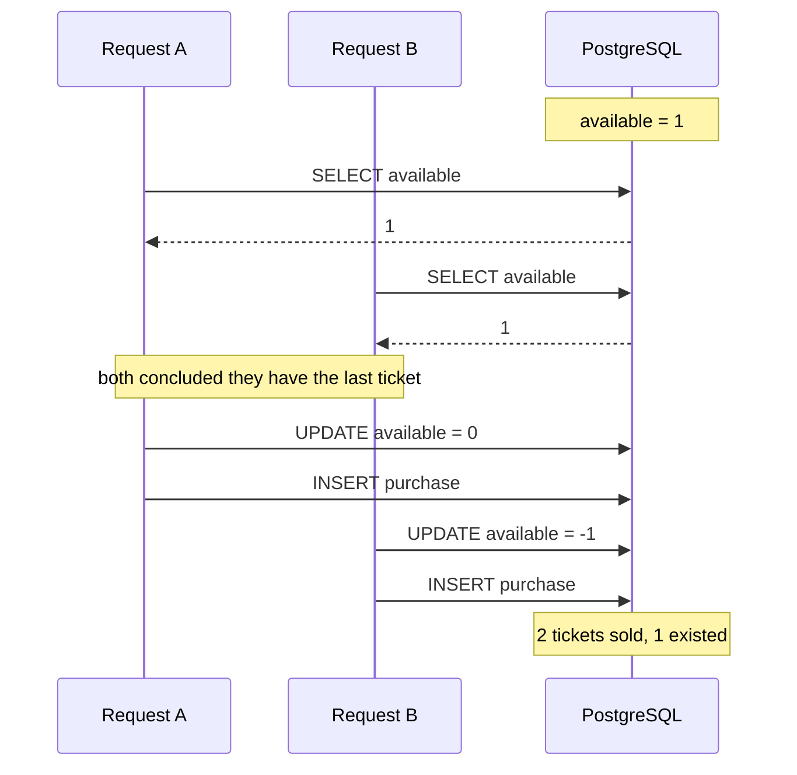

# High Concurrency Ticket Office

[](https://github.com/FranciscoPLoureiro/HighConcurrencyTicketOffice/actions/workflows/ci.yml)

A student festival releases exactly **100 tickets at 80% off**, and the campaign
opens at midnight. Around **5,000 people** press *Buy* inside the same few
seconds. This is the backend that sells those tickets without ever selling 101,
without letting one person take two, and without losing a ticket if a process
dies halfway through a purchase.

The last of those is the interesting one. The stock lives in Redis and the
fulfilment work lives in RabbitMQ; they are separate systems that fail
independently, so "decrement the stock, then publish the job" has a gap in the
middle where a ticket can vanish. Most of this repository is about that gap.

## Status

Built in phases, each one a branch of small commits merged through a pull
request.

| Phase | Scope | State |
|---|---|---|
| 0 | CI/CD, containers, health checks | ✅ done |
| 1 | Naive MVP that demonstrates the race | ✅ done |
| 2 | Atomic purchase in Redis, stock reconciliation | ✅ done |
| 3 | Async fulfilment with RabbitMQ, idempotency | ⬜ |
| 4 | Prometheus, Grafana, calibrated load testing | ⬜ |
| 5 | The lost ticket, compensation saga, failure modes | ⬜ |

Sections below marked *(phase N)* describe work that has not landed yet and are
listed so the shape of the system is visible from the start.

## Quick start

Requires Docker and GNU make. Everything else the project builds or runs with —
the Go toolchain, the linter, the load generator — is pulled as an image, so
there is nothing to install and nothing to keep in step with CI.

```bash
make up
curl localhost:8080/health
```

```json
{
  "status": "ok",
  "checks": {
    "postgres": { "status": "ok", "latency_ms": 1 },
    "redis":    { "status": "ok", "latency_ms": 0 }
  }
}
```

`/health` returns **503** when any dependency is unreachable, so an orchestrator
can act on the status line without parsing the body. The body still names the
failing dependency, because that is the difference between an alert someone can
act on and one they cannot.

| Command | Does |
|---|---|
| `make up` | Build and start everything, waiting until healthy |
| `make test` | Tests with the race detector |
| `make lint` | golangci-lint |
| `make verify` | Everything CI runs, in the same order |
| `make integration-test` | Tests against real containers via Testcontainers |
| `make load-test` | k6 smoke test against a running stack |
| `make load-test-campaign-internal` | The campaign, generated inside the network |
| `make reset` | Destroy all state and come back up clean |

Run `make` on its own for the full list. The two `load-test` targets that drive
the API from the host expect a `k6` binary there; the `-internal` one, which is
the only one whose numbers this README quotes, runs k6 from an image.

## The API

```bash
curl -X POST localhost:8080/api/v1/tickets/purchase -H 'X-User-ID: student-1'
```

Every outcome has its own status and its own machine-readable code. Two of them
share a status, so the code is the contract and the prose beside it is not —
a client should switch on `error.code`, never on the message.

| Status | `error.code` | Means |
|---|---|---|
| `200` | — | The ticket is yours |
| `409` | `stock_exhausted` | The campaign is empty |
| `409` | `already_purchased` | You already hold one |
| `429` | `rate_limited` | Too many attempts; see `Retry-After` |
| `401` | `missing_identity` | No `X-User-ID` header |
| `404` | `campaign_not_found` | No such campaign, or Redis holds no stock for it |

```json
{ "error": { "code": "already_purchased",
             "message": "this account already holds a ticket for this campaign" } }
```

`404` covers a case worth naming: if Redis has no stock counter for the
campaign, the answer is *not* `stock_exhausted`. A missing key means
reconciliation has not run, and telling a caller "sold out" in that state is a
lie that looks like a normal, final refusal — they stop trying and nobody
investigates. It is a `404` and a loud log line instead.

### Measure the generator before believing the numbers

On Docker Desktop for Windows, driving the API through its published port
refused **57% of connections** at 500 virtual users — before a single request
reached the application. The API logged nothing, because nothing arrived.

Worse, the first version of the load test scored that run as a pass: k6 reports
status `0` for a request that never got a response, and the check was
`status < 500`. Both the measurement and the thing measuring it were wrong.

`make load-test-campaign-internal` runs the generator on the same Docker network
as the API, which removes the host's port forwarding from the path: 0% failures,
same hardware. Any number quoted in this README comes from that path.

### The Go toolchain runs in a container

`make test` and friends execute the Go toolchain inside `golang:1.26` rather
than on the host, so local builds and CI compile in the same environment. It is
also a hard requirement on the machine this was developed on, where Windows
Smart App Control blocks the unsigned Go toolchain binaries outright. Pass
`GO_LOCAL=1` to use a host toolchain instead:

```bash
make test GO_LOCAL=1
```

## Architecture

Solid lines are built. Dashed ones are phases 3 and 5.

```
Client ──Idempotency-Key┄┄> [Rate limiter] ──429 + Retry-After──>
                                  │          sliding window, per user and per IP
                                  v
                            [API — Go] ┄┄idempotency cache┄┄> previous response
                                  │
                                  v
                    [Redis: one atomic Lua script]
             checks the buyer, checks stock, decrements, records
                    │                              │
                success                     no stock / already bought
                    v                              v
              [PostgreSQL]                    409 Conflict
              records the purchase
                    ┊
                    ┊┄┄> [RabbitMQ] ┄┄> [Worker] ┄┄> [DLQ] ┄┄> INCR in Redis
                                        generates the ticket, acks

  [PostgreSQL] ── source of truth; rebuilds the Redis stock *and* the set of
                  people who already bought, under a distributed lock, on
                  every start
```

The purchase writes to Redis and then to PostgreSQL, and those two writes are
not atomic with each other — they are separate systems. That gap is the subject
of phase 5. Today it is narrowed rather than closed: a failed write hands the
ticket back, a process that dies between them loses one until the next
reconciliation.

## Architectural decisions

The format is deliberate: context, the options that were actually considered,
the decision, and what it costs.

### Why Go

**Context.** The load is roughly 5,000 concurrent requests arriving in a few
seconds, each one mostly waiting on network I/O to Redis, Postgres and RabbitMQ.
Nearly all of the wall clock is spent blocked, not computing.

**Options.** Go, Java with Spring Boot, or C# on .NET. All three can do this.

**Decision.** Go, for two properties that matter under exactly this shape of
load.

A goroutine starts with a **2 KiB stack** that grows by copying as needed, so
5,000 in-flight requests cost single-digit megabytes of stack. Modelling the
same concurrency with OS threads costs a default 8 MiB of virtual address space
each, and the kernel scheduler starts to matter well before that number.

More importantly, blocking is cheap in the case this system actually hits. When
a goroutine waits on a socket, the runtime parks it in the **netpoller** — epoll
underneath — and the OS thread immediately runs another goroutine. No thread is
consumed by waiting. This is not universal: a genuinely blocking syscall does
block its thread, and the runtime responds by handing that processor to another
thread. Since essentially all the waiting here is network I/O, the system stays
on the cheap path.

The garbage collector is a concurrent mark-and-sweep with sub-millisecond stop
the world pauses. For a project judged on p99 latency, a collector that does not
introduce tail spikes is worth more than raw throughput.

**Consequences.** Cheap concurrency makes it easy to write code that leaks
goroutines instead of threads, which is quieter and harder to notice. Every
outbound call therefore carries a context with a deadline, and the race detector
runs in CI on every push.

### Why a SELECT followed by an UPDATE does not hold

**Context.** The obvious way to sell a ticket is to read the stock, decide, and
write. Phase 1 does exactly that, on purpose, so the failure can be measured
before it is fixed.

```sql
SELECT available FROM tickets WHERE campaign_id = $1;  -- 100
-- application decides: there is stock
UPDATE tickets SET available = available - 1 WHERE campaign_id = $1;
INSERT INTO purchases ...;
```

Each statement is individually atomic. The **sequence** is not. Postgres runs
at READ COMMITTED by default, which guarantees a statement never sees another
transaction's uncommitted work — and guarantees nothing whatsoever about a value
still being true by the time the application acts on it. The gap between reading
and writing is where every other request reads the same value.



**Measured, not asserted.** With 500 virtual students against a 100 ticket
campaign, through the real HTTP API, on the same machine and the same command
for both columns — `make reset` first, generator inside the Docker network:

| | Phase 1 — SELECT then UPDATE | Phase 2 — one Lua script |
|---|---|---|
| Tickets sold | **500** | **100** |
| Oversold | **400** | **0** |
| Users holding more than one | 0 | 0 |
| `available` in PostgreSQL afterwards | **−400** | 0 |
| Refused `stock_exhausted` | 0 | 400 |
| Requests that failed to get a response | 0 | 0 |
| p95 latency | 2.65 s | **1.01 s** |
| p90 latency | 2.64 s | 0.77 s |
| Throughput | 176 req/s | **372 req/s** |
| Wall clock for all 500 | 2.8 s | **1.3 s** |

Phase 1 sold not 101, not 140, but every ticket asked for: every request read
the same availability, concluded it had the last one, and got it. The
integration test reproduces it in miniature — 300 requests, 20 tickets, 300
sold — and **asserts** the failure, so that if it ever stops reproducing the
comparison above is known to be measuring nothing rather than quietly passing.

The latency column is the part worth reading twice, because it is the opposite
of what "we added a second datastore" suggests. Phase 1 was not slow because of
Postgres; it was slow because five hundred connections queued on one row's
locks. Phase 2 answers four hundred of those requests from Redis without
touching Postgres at all, so only the hundred winners ever open a transaction.
Correctness and latency moved in the same direction, which is the case for
Redis here — not that SQL could not have been made correct.

**Options.** `SELECT ... FOR UPDATE` to lock the row; a single conditional
`UPDATE ... WHERE available > 0` that is atomic by itself; or move the decision
out of Postgres entirely.

**Decision.** The decision moved to Redis — but the honest answer to "why not
just fix the SQL?" is that fixing the SQL *would work*. For 100 tickets a single
conditional `UPDATE ... WHERE available > 0` is correct and Postgres would not
break a sweat. Pretending otherwise would be inventing a problem to justify a
solution.

Redis earns its place for different reasons: it keeps the write burst off the
primary database, it keeps latency flat instead of degrading with lock
contention, and it makes the stock check and the one-per-user check a **single**
atomic operation over two different keys — which row locking on one table does
not give you.

The measurements above bear the second of those out more strongly than expected.
Adding a datastore made the p95 better, not worse, because four hundred of the
five hundred requests are now answered without opening a transaction at all.

**Consequences.** The invariant now lives outside the source of truth, so the two
can disagree. Everything interesting in this phase and phase 5 follows from that:
rebuilding Redis from Postgres at startup, and what happens when a process dies
between the two writes.

### Why one Lua script instead of WATCH/MULTI/EXEC

**Context.** Selling a ticket means establishing two facts and making two writes
that follow from them: this person does not already hold a ticket, there is
stock left, and therefore the counter drops by one and the person is recorded as
a holder. Two keys, two conditions, one decision. Any gap between them is a
race — either two requests both read `stock = 1`, or one person's two tabs both
pass the duplicate check.

**Options.**

*`DECR` and check the result.* Genuinely atomic, and the first thing that comes
to mind. It fails on both counts here: the stock goes negative before you can
correct it, so other clients observe a number that was never true, and it has
nothing to say about who the buyer is. The one-per-user check would still need
its own round trip, and that round trip is a race.

*WATCH/MULTI/EXEC — optimistic locking.* `WATCH` both keys, read them, decide,
queue the writes, `EXEC`. If either key changed in the meantime the transaction
aborts and the client retries. Native to Redis, no new language.

*A Lua script.* Redis executes it to completion before looking at another
command, so the whole decision is one indivisible step by construction.

**Decision.** Lua — [`purchase.lua`](internal/cache/scripts/purchase.lua).

The case against WATCH is that its cost scales with contention, and contention
is the entire problem. Five thousand clients watching the same key means nearly
every `EXEC` aborts; each retry is another round trip that re-reads and
re-decides, so the number of attempts per success climbs precisely when the
system is busiest. Optimistic locking is a good trade when conflicts are rare.
Here a conflict is the expected case.

There is a second, less obvious cost. `WATCH` is per-connection state, so a
client library has to pin a pooled connection for the length of a multi-round-
trip conversation. Five thousand concurrent purchases would hold five thousand
conversations open against a connection pool sized for far fewer.

The script is one round trip, no retries, and no pinned connection. It is sent
with `EVALSHA` and only shipped in full when the server answers `NOSCRIPT`, so
the body crosses the wire once per server lifetime rather than once per
purchase.

**Consequences.** Three, and the first is the one that matters.

Redis is single-threaded, which is exactly what makes the script atomic and
exactly what makes a slow script a global outage: while it runs, nothing else in
the server does. Every script here is O(1) except reconciliation, which is
O(buyers) and therefore chunks its writes rather than unpacking an unbounded
argument list in one call. "Keep the script short" is not style advice in Redis;
it is the price of the guarantee.

Lua is a second language in the codebase, and a worse one to debug — there is no
stepping through an `EVALSHA`. The scripts live in their own files under
[`internal/cache/scripts`](internal/cache/scripts) rather than as Go string
literals, so at least they read as code.

And a script may only touch keys in one Redis Cluster slot. The keys carry hash
tags (`campaign:{id}:stock`, `campaign:{id}:buyers`) so both always land on the
same node. On a single instance this changes nothing; without it, the first
attempt to run behind a cluster would fail.

### Why the stock is rebuilt from PostgreSQL on every start

**Context.** Redis holds the invariant, and Redis holds it in memory. Something
has to put the number there when a process starts.

**Options.** `SET stock 100` at boot, or compute it from the source of truth.

**Decision.** Compute it — and treat the one-line version as a bug rather than a
simplification, because that is what it is. Writing the campaign size at boot
means every deploy, crash, OOM kill and rolling restart refills the shelf, and
the tickets that come back out of it have already been sold. A campaign is
decided in a few minutes; the odds of no process restarting during it are not
odds worth taking.

So at startup, under a distributed lock, the service reads the campaign size and
every live purchase from PostgreSQL and writes both derived values into Redis in
a single script. PostgreSQL is the source of truth; Redis is a fast projection
of it, and this is the thing that makes that sentence true rather than
aspirational.

**Rebuilding the buyer set is half of this, and the half that gets forgotten.**
The brief asks only for the stock, and a service that restores the count but not
the holders looks completely healthy: the counter is right, the arithmetic
works, nothing logs an error. What it has lost is its memory. Every one of the
forty people who already bought can buy again, the campaign quietly sells more
tickets than it has to fewer people than it should, and the one-per-user rule
stops existing halfway through with no symptom that points at it. Both halves
are restored here, in one script, so the state is never observably
half-rebuilt — a `DEL` followed by a separate `SADD` leaves a window in which
the set is empty and a purchase landing in it is granted to somebody who already
holds a ticket.

**Verified against the running stack, not only in a test.** Sell 40 of 100, wipe
Redis completely — a harder failure than a restart — and restart the API:

```
--- sell 40 ---
tickets_sold ......... 40
--- redis after 40 sales ---
stock=60  buyers=40
--- FLUSHALL, then restart the api ---
stock=60  buyers=40
```

```json
{"msg":"reconciled redis from postgres","campaign_id":"queima-2026",
 "remaining":60,"holders":40,"redis_had_state":false,"previous_remaining":0}
```

Sixty, not one hundred. And `student-1`, who bought before the wipe, is still
refused with `already_purchased` afterwards — which is the half that has no
symptom when it is missing.

**Consequences.** Startup now depends on PostgreSQL being reachable, which is a
real cost: the service cannot come up during a database outage. In exchange it
survives restarts mid-campaign without violating the invariant, which is the
trade worth making — a service that starts during an outage and sells tickets
twice is not usefully available.

The lock is a single `SET NX PX` on one Redis instance, and that is not Redlock.
If Redis failed over to a replica that had not yet received the key, two holders
could exist at once. It is enough here because the critical section is
idempotent — several instances recomputing the same numbers from the same source
of truth converge on the same answer — so the failure mode is duplicated work,
not a broken invariant. A lock protecting something that is not idempotent would
need more than this, and it is worth knowing which kind you have.

### What Redis persistence buys, and what it does not

**Context.** Redis is the only place the stock invariant is enforced. If it
restarts, what comes back?

**Options.** RDB snapshots, AOF, or both.

**Decision.** Both, with `appendfsync everysec`, configured explicitly in
[`docker-compose.yml`](docker-compose.yml) rather than left at the image
default.

The default is RDB alone, and the default schedule measures the gap between
snapshots in minutes. For a campaign decided in the first few seconds, a
snapshot from minutes ago is indistinguishable from no snapshot. AOF at
`everysec` bounds the loss at roughly one second of writes. `always` would bound
it at zero, and would put an `fsync` on the critical path of every purchase —
the one path this whole design spends effort keeping fast. One second of tickets
is recoverable. The latency is not.

Both are on because they answer different questions: the AOF is what replays
after a crash, and the RDB is the compact file worth copying somewhere else.

**Consequences, and the honest part.** None of this is what makes the system
correct after Redis dies. Losing a second of writes would leave Redis claiming
tickets that PostgreSQL says are sold — and the startup reconciliation above
overwrites it from PostgreSQL anyway, which it would do just as correctly if the
AOF were empty. The persistence narrows the window during which a *running*
Redis is wrong; the reconciliation is what closes it. Configuring persistence
and calling the durability problem solved would be the mistake here.

### Rate limiting, and which way each control fails

**Context.** Five thousand people arrive in a few seconds, and some of them are
scripts.

**Decision.** A sliding window over a sorted set of request timestamps
([`ratelimit.lua`](internal/cache/scripts/ratelimit.lua)), applied per account
and per address, answering `429` with a `Retry-After` header.

A fixed window counter is cheaper — one `INCR` and an expiry — but it allows a
full allowance at the end of one window and another immediately at the start of
the next, so the effective limit doubles across the boundary. On a campaign that
is decided in its first seconds, that boundary is the only part of the timeline
that matters, so the cheap option is cheap in exactly the wrong place. The cost
of the sliding window is memory proportional to the limit per caller, which is
why the key expires with the window.

**The per-address limit is deliberately loose, and per-address limiting is the
weaker of the two controls here.** The audience is a university: thousands of
students share a handful of NAT addresses, so a tight per-IP limit does not stop
an attacker, it stops a hall of residence. It is set to absorb the entire
expected burst from one address and to catch only a single machine going orders
of magnitude beyond human speed. This interacts with the load test, which drives
every virtual user from one container and therefore one address — raise `VUS`
above `RATE_LIMIT_IP` and the generator starts rate limiting itself. That is the
limiter working, and the k6 output counts the two refusal reasons separately so
the difference is visible rather than mysterious.

**The two controls fail in opposite directions, on purpose.** If Redis is
unreachable the rate limiter allows the request, and the purchase behind it
refuses. A rate limit protects the system from load; it enforces no invariant,
so turning a Redis blip into a blanket `429` for every caller invents a second
outage on top of the first. The purchase does enforce an invariant, and Redis is
the only place it is enforced, so a purchase that cannot consult Redis is one
nobody can prove is safe — it fails closed. Getting these the same way round
would be wrong twice.

`X-Forwarded-For` is ignored. It is trivially forged, and a limiter that a
caller can opt out of by inventing a new address every request is worse than no
limiter, because it is believed. Behind a real proxy this would have to read the
header at a hop count the proxy guarantees.

### Why the standard library instead of a web framework

**Context.** The API has a handful of routes and needs middleware for identity,
rate limiting and idempotency.

**Options.** `chi`, `gin`, or `net/http`.

**Decision.** `net/http`. Since Go 1.22 the standard `ServeMux` matches on
method and path pattern (`GET /api/v1/tickets/{id}/status`), which is the only
feature a router was previously needed for. Middleware is a function that takes
and returns an `http.Handler`.

**Consequences.** A dependency avoided on the request path, and no framework
conventions between the reader and what the code does. The cost is writing a few
middleware helpers by hand that a framework would have supplied.

## Known limitations

Kept honest as the project grows.

- Authentication is out of scope by design. Requests carry an `X-User-ID`
  header, standing in for a JWT already validated by a gateway. This is a
  deliberate simplification of the brief, not an oversight — the interesting
  problem here is contention, not identity.
- Payment is out of scope. A purchase reserves a ticket; no money moves.
- **A process that dies between the two writes loses a ticket.** Redis grants
  it and PostgreSQL records it, and those are separate systems: if the write to
  PostgreSQL *fails*, the ticket is handed straight back, but if the process
  dies in between, the ticket is decremented from a stock it never leaves. It
  belongs to nobody until the next reconciliation. This is the central problem
  of the whole design and phase 5.1 is where it is solved properly, with a
  reservation that expires. Today the window is milliseconds wide and the
  failure direction is safe — the campaign undersells rather than oversells.
- **Reconciliation can overwrite a purchase made during a rolling deploy.** It
  reads PostgreSQL and writes Redis under a lock, but purchases do not take
  that lock, so a sale committing on an already-running instance inside that
  window is not reflected in what gets written. The window is one database read
  wide, and the database read happens inside the lock to keep it that way. It
  is not zero.
- **The reconciliation lock is not Redlock.** One `SET NX PX` against one Redis
  instance; a failover to a replica that had not received the key would allow
  two holders. It is safe here only because the critical section is idempotent.
- **Per-address rate limiting is weak for this audience.** Thousands of students
  behind a handful of university NAT addresses means the limit has to be loose
  enough to be nearly inert. The per-account limit does the real work.
- **A client that retries after a timeout cannot recover its purchase.** It gets
  `already_purchased` rather than the original response, which is safe but
  unhelpful. The client-supplied `Idempotency-Key` in phase 3 is what fixes it.
- Phase 1's naive purchase path is still in the tree, unused by the API. It is
  the baseline the table above is measured against, and an integration test
  asserts that it still oversells — if that ever stops reproducing, the
  comparison is measuring nothing and should fail loudly rather than quietly
  pass.
- Load figures come from one developer machine with the generator on the same
  Docker network. They are useful for before-and-after comparison on identical
  hardware and mean nothing as an absolute capacity claim. Phase 4 declares the
  environment and resource limits properly.

## Roadmap

Beyond the phases above: real authentication, infrastructure as code rather than
a Makefile, and multi-region — none of which change the concurrency problem this
project exists to solve.

## Licence

MIT. See [LICENSE](LICENSE).
