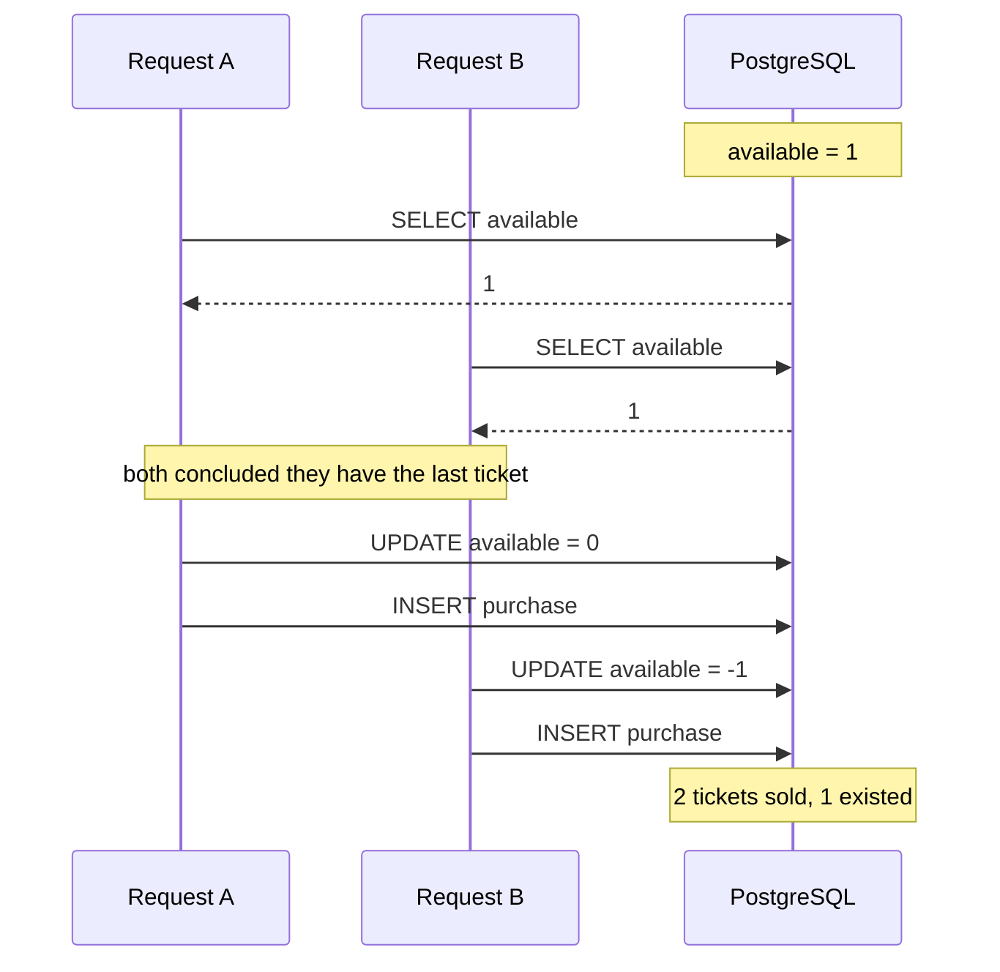

# Architectural decisions

The format is deliberate: context, the options that were actually considered,
the decision, and what it costs.

## Why Go

**Context.** The load is roughly 5,000 concurrent requests arriving in a few
seconds, each one mostly waiting on network I/O to Redis, Postgres and RabbitMQ.
Nearly all of the wall clock is spent blocked, not computing.

**Options.** Go, Java with Spring Boot, or C# on .NET. All three can do this.

**Decision.** Go, for two properties that matter under exactly this shape of
load.

A goroutine starts with a **2 KiB stack** that grows by copying as needed, so
5,000 in-flight requests cost single-digit megabytes of stack. Modelling the
same concurrency with OS threads costs a default 8 MiB of virtual address space
each, and the kernel scheduler starts to matter well before that number.

More importantly, blocking is cheap in the case this system actually hits. When
a goroutine waits on a socket, the runtime parks it in the **netpoller** — epoll
underneath — and the OS thread immediately runs another goroutine. No thread is
consumed by waiting. This is not universal: a genuinely blocking syscall does
block its thread, and the runtime responds by handing that processor to another
thread. Since essentially all the waiting here is network I/O, the system stays
on the cheap path.

The garbage collector is a concurrent mark-and-sweep with sub-millisecond stop
the world pauses. For a project judged on p99 latency, a collector that does not
introduce tail spikes is worth more than raw throughput.

**Consequences.** Cheap concurrency makes it easy to write code that leaks
goroutines instead of threads, which is quieter and harder to notice. Every
outbound call therefore carries a context with a deadline, and the race detector
runs in CI on every push.

## Why a SELECT followed by an UPDATE does not hold

**Context.** The obvious way to sell a ticket is to read the stock, decide, and
write. Phase 1 does exactly that, on purpose, so the failure can be measured
before it is fixed.

```sql
SELECT available FROM tickets WHERE campaign_id = $1;  -- 100
-- application decides: there is stock
UPDATE tickets SET available = available - 1 WHERE campaign_id = $1;
INSERT INTO purchases ...;
```

Each statement is individually atomic. The **sequence** is not. Postgres runs
at READ COMMITTED by default, which guarantees a statement never sees another
transaction's uncommitted work — and guarantees nothing whatsoever about a value
still being true by the time the application acts on it. The gap between reading
and writing is where every other request reads the same value.



**Measured, not asserted.** With 500 virtual students against a 100 ticket
campaign, through the real HTTP API, on the same machine and the same command
for both columns — `make reset` first, generator inside the Docker network:

| | Phase 1 — SELECT then UPDATE | Phase 2 — one Lua script | Phase 3 — 202 and a worker |
|---|---|---|---|
| Tickets sold | **500** | **100** | **100** |
| Oversold | **400** | **0** | **0** |
| Users holding more than one | 0 | 0 | 0 |
| `available` in PostgreSQL afterwards | **−400** | 0 | 0 |
| Refused `stock_exhausted` | 0 | 400 | 400 |
| Requests that failed to get a response | 0 | 0 | 0 |
| p95 latency | 2.65 s | 1.01 s | **0.58 s** |
| p90 latency | 2.64 s | 0.77 s | **0.48 s** |
| Throughput | 176 req/s | 372 req/s | **564 req/s** |
| Wall clock for all 500 | 2.8 s | 1.3 s | **0.9 s** |

Phase 3 adds a synchronous `INSERT` and a confirmed publish to the request path
and comes out *faster*, which deserves an explanation rather than a victory lap.
Two things moved. The connection pool is now sized deliberately — sixteen
connections with four kept warm, against a default that depends on the machine
and dials on demand, so the hundred winners no longer queue behind a handshake
apiece at exactly the wrong moment. And the response no longer waits on anything
slow, because there is nothing slow left on that path: the two-second render
moved to the worker, which is the entire point of the phase.

What the table does *not* show is time to a finished ticket. That is now a
separate question with a separate answer — a single worker at `FULFILMENT_DELAY=2s`
takes about three and a half minutes to drain a hundred, and `--scale worker=3`
divides it. Answering "how long until my PDF exists?" with a number from this
table would be the kind of quiet dishonesty the 202 exists to avoid.

The phase 3 run, unedited:

```
     ✓ no server error
     ✓ answer is one of the documented outcomes
     ✓ the request was well formed

     checks_total.......: 1500    1691.563277/s
     checks_succeeded...: 100.00% 1500 out of 1500
     checks_failed......: 0.00%   0 out of 1500

     ✓ http_req_failed ....... rate<0.01  rate=0.00%

     rejected_stock_exhausted: 400
     tickets_sold............: 100
     http_req_duration.......: avg=259.31ms med=208.2ms p(90)=478.61ms p(95)=576.05ms
     iterations..............: 500     563.854426/s
```

and the state it left behind, in both systems:

```
redis     stock=0  buyers=100
postgres  100 live tickets, 0 users holding more than one, available=0
          (11 confirmed, 89 pending at the moment of the check — all 100
           confirmed once the worker caught up, with every queue empty and
           nothing in the dead letter queue)
```

Phase 1 sold not 101, not 140, but every ticket asked for: every request read
the same availability, concluded it had the last one, and got it.

**Repeated, because one run could have been luck.** The integration test runs
the same contest five times against a campaign reset in between, and prints what
each run oversold:

```
5 runs of 300 requests against 20 tickets
  run | sold | oversold
    1 |  300 |      280
    2 |  300 |      280
    3 |  300 |      280
    4 |  300 |      280
    5 |  300 |      280
```

Not a distribution with an unlucky tail — the naive path loses the race every
time, by the same margin. The test **asserts** that every run oversells, so if
it ever stops reproducing (a Postgres that locks differently, a machine too slow
to interleave) the comparison above is known to be measuring nothing rather than
quietly passing.

The latency column is the part worth reading twice, because it is the opposite
of what "we added a second datastore" suggests. Phase 1 was not slow because of
Postgres; it was slow because five hundred connections queued on one row's
locks. Phase 2 answers four hundred of those requests from Redis without
touching Postgres at all, so only the hundred winners ever open a transaction.
Correctness and latency moved in the same direction, which is the case for
Redis here — not that SQL could not have been made correct.

**Options.** `SELECT ... FOR UPDATE` to lock the row; a single conditional
`UPDATE ... WHERE available > 0` that is atomic by itself; or move the decision
out of Postgres entirely.

**Decision.** The decision moved to Redis — but the honest answer to "why not
just fix the SQL?" is that fixing the SQL *would work*. For 100 tickets a single
conditional `UPDATE ... WHERE available > 0` is correct and Postgres would not
break a sweat. Pretending otherwise would be inventing a problem to justify a
solution.

Redis earns its place for different reasons: it keeps the write burst off the
primary database, it keeps latency flat instead of degrading with lock
contention, and it makes the stock check and the one-per-user check a **single**
atomic operation over two different keys — which row locking on one table does
not give you.

The measurements above bear the second of those out more strongly than expected.
Adding a datastore made the p95 better, not worse, because four hundred of the
five hundred requests are now answered without opening a transaction at all.

**Consequences.** The invariant now lives outside the source of truth, so the two
can disagree. Everything interesting in this phase and phase 5 follows from that:
rebuilding Redis from Postgres at startup, and what happens when a process dies
between the two writes.

## Why one Lua script instead of WATCH/MULTI/EXEC

**Context.** Selling a ticket means establishing two facts and making two writes
that follow from them: this person does not already hold a ticket, there is
stock left, and therefore the counter drops by one and the person is recorded as
a holder. Two keys, two conditions, one decision. Any gap between them is a
race — either two requests both read `stock = 1`, or one person's two tabs both
pass the duplicate check.

**Options.**

*`DECR` and check the result.* Genuinely atomic, and the first thing that comes
to mind. It fails on both counts here: the stock goes negative before you can
correct it, so other clients observe a number that was never true, and it has
nothing to say about who the buyer is. The one-per-user check would still need
its own round trip, and that round trip is a race.

*WATCH/MULTI/EXEC — optimistic locking.* `WATCH` both keys, read them, decide,
queue the writes, `EXEC`. If either key changed in the meantime the transaction
aborts and the client retries. Native to Redis, no new language.

*A Lua script.* Redis executes it to completion before looking at another
command, so the whole decision is one indivisible step by construction.

**Decision.** Lua — [`purchase.lua`](internal/cache/scripts/purchase.lua).

The case against WATCH is that its cost scales with contention, and contention
is the entire problem. Five thousand clients watching the same key means nearly
every `EXEC` aborts; each retry is another round trip that re-reads and
re-decides, so the number of attempts per success climbs precisely when the
system is busiest. Optimistic locking is a good trade when conflicts are rare.
Here a conflict is the expected case.

There is a second, less obvious cost. `WATCH` is per-connection state, so a
client library has to pin a pooled connection for the length of a multi-round-
trip conversation. Five thousand concurrent purchases would hold five thousand
conversations open against a connection pool sized for far fewer.

The script is one round trip, no retries, and no pinned connection. It is sent
with `EVALSHA` and only shipped in full when the server answers `NOSCRIPT`, so
the body crosses the wire once per server lifetime rather than once per
purchase.

**Consequences.** Three, and the first is the one that matters.

Redis is single-threaded, which is exactly what makes the script atomic and
exactly what makes a slow script a global outage: while it runs, nothing else in
the server does. Every script here is O(1) except reconciliation, which is
O(buyers) and therefore chunks its writes rather than unpacking an unbounded
argument list in one call. "Keep the script short" is not style advice in Redis;
it is the price of the guarantee.

Lua is a second language in the codebase, and a worse one to debug — there is no
stepping through an `EVALSHA`. The scripts live in their own files under
[`internal/cache/scripts`](internal/cache/scripts) rather than as Go string
literals, so at least they read as code.

And a script may only touch keys in one Redis Cluster slot. The keys carry hash
tags (`campaign:{id}:stock`, `campaign:{id}:buyers`) so both always land on the
same node. On a single instance this changes nothing; without it, the first
attempt to run behind a cluster would fail.

## Why the stock is rebuilt from PostgreSQL on every start

**Context.** Redis holds the invariant, and Redis holds it in memory. Something
has to put the number there when a process starts.

**Options.** `SET stock 100` at boot, or compute it from the source of truth.

**Decision.** Compute it — and treat the one-line version as a bug rather than a
simplification, because that is what it is. Writing the campaign size at boot
means every deploy, crash, OOM kill and rolling restart refills the shelf, and
the tickets that come back out of it have already been sold. A campaign is
decided in a few minutes; the odds of no process restarting during it are not
odds worth taking.

So at startup, under a distributed lock, the service reads the campaign size and
every live purchase from PostgreSQL and writes both derived values into Redis in
a single script. PostgreSQL is the source of truth; Redis is a fast projection
of it, and this is the thing that makes that sentence true rather than
aspirational.

**Live means not cancelled, not "confirmed".** Since phase 3 a sale is recorded
before its ticket is generated, so at any instant some purchases are `pending`
and, if a worker gave up, some are `failed`. Every one of them is a seat
somebody is holding. Asking `status = 'confirmed'` instead would undercount by
however far the workers happen to be behind and hand those seats to other
people — which is why the query, the partial unique index and
`domain.Status.Live` all phrase it the same way. It is also the reason the API
writes the row itself rather than leaving it to the worker; that argument has
[its own section](#why-the-api-writes-the-purchase-not-the-worker).

**Rebuilding the buyer set is half of this, and the half that gets forgotten.**
The brief asks only for the stock, and a service that restores the count but not
the holders looks completely healthy: the counter is right, the arithmetic
works, nothing logs an error. What it has lost is its memory. Every one of the
forty people who already bought can buy again, the campaign quietly sells more
tickets than it has to fewer people than it should, and the one-per-user rule
stops existing halfway through with no symptom that points at it. Both halves
are restored here, in one script, so the state is never observably
half-rebuilt — a `DEL` followed by a separate `SADD` leaves a window in which
the set is empty and a purchase landing in it is granted to somebody who already
holds a ticket.

**Verified against the running stack, not only in a test.** Sell 40 of 100, wipe
Redis completely — a harder failure than a restart — and restart the API:

```
--- sell 40 ---
tickets_sold ......... 40
--- redis after 40 sales ---
stock=60  buyers=40
--- FLUSHALL, then restart the api ---
stock=60  buyers=40
```

```json
{"msg":"reconciled redis from postgres","campaign_id":"queima-2026",
 "remaining":60,"holders":40,"redis_had_state":false,"previous_remaining":0}
```

Sixty, not one hundred. And `student-1`, who bought before the wipe, is still
refused with `already_purchased` afterwards — which is the half that has no
symptom when it is missing.

**Re-run in the hardest case phase 3 introduces.** The forty sales above were
made with the worker *stopped*, so every one of them was still `pending` when
Redis was wiped — not one had been confirmed:

```
--- postgres after 40 sales, worker stopped ---
 pending | 40
--- FLUSHALL, then restart the api ---
stock=60  buyers=40
```

This is the measurement that decides the design. Had the worker been the one to
write these rows, PostgreSQL would have held *nothing*, reconciliation would
have computed a stock of one hundred and a buyer set of zero, and all forty
seats would have gone on sale again to people who could not have them. Starting
the worker afterwards confirmed all forty from messages that had outlived the
Redis wipe and the API restart, because the queue is durable and its messages
persistent.

**Consequences.** Startup now depends on PostgreSQL being reachable, which is a
real cost: the service cannot come up during a database outage. In exchange it
survives restarts mid-campaign without violating the invariant, which is the
trade worth making — a service that starts during an outage and sells tickets
twice is not usefully available.

The lock is a single `SET NX PX` on one Redis instance, and that is not Redlock.
If Redis failed over to a replica that had not yet received the key, two holders
could exist at once. It is enough here because the critical section is
idempotent — several instances recomputing the same numbers from the same source
of truth converge on the same answer — so the failure mode is duplicated work,
not a broken invariant. A lock protecting something that is not idempotent would
need more than this, and it is worth knowing which kind you have.

## What Redis persistence buys, and what it does not

**Context.** Redis is the only place the stock invariant is enforced. If it
restarts, what comes back?

**Options.** RDB snapshots, AOF, or both.

**Decision.** Both, with `appendfsync everysec`, configured explicitly in
[`docker-compose.yml`](docker-compose.yml) rather than left at the image
default.

The default is RDB alone, and the default schedule measures the gap between
snapshots in minutes. For a campaign decided in the first few seconds, a
snapshot from minutes ago is indistinguishable from no snapshot. AOF at
`everysec` bounds the loss at roughly one second of writes. `always` would bound
it at zero, and would put an `fsync` on the critical path of every purchase —
the one path this whole design spends effort keeping fast. One second of tickets
is recoverable. The latency is not.

Both are on because they answer different questions: the AOF is what replays
after a crash, and the RDB is the compact file worth copying somewhere else.

**Consequences, and the honest part.** None of this is what makes the system
correct after Redis dies. Losing a second of writes would leave Redis claiming
tickets that PostgreSQL says are sold — and the startup reconciliation above
overwrites it from PostgreSQL anyway, which it would do just as correctly if the
AOF were empty. The persistence narrows the window during which a *running*
Redis is wrong; the reconciliation is what closes it. Configuring persistence
and calling the durability problem solved would be the mistake here.

## Rate limiting, and which way each control fails

**Context.** Five thousand people arrive in a few seconds, and some of them are
scripts.

**Decision.** A sliding window over a sorted set of request timestamps
([`ratelimit.lua`](internal/cache/scripts/ratelimit.lua)), applied per account
and per address, answering `429` with a `Retry-After` header.

A fixed window counter is cheaper — one `INCR` and an expiry — but it allows a
full allowance at the end of one window and another immediately at the start of
the next, so the effective limit doubles across the boundary. On a campaign that
is decided in its first seconds, that boundary is the only part of the timeline
that matters, so the cheap option is cheap in exactly the wrong place. The cost
of the sliding window is memory proportional to the limit per caller, which is
why the key expires with the window.

**The per-address limit is deliberately loose, and per-address limiting is the
weaker of the two controls here.** The audience is a university: thousands of
students share a handful of NAT addresses, so a tight per-IP limit does not stop
an attacker, it stops a hall of residence. It is set to absorb the entire
expected burst from one address and to catch only a single machine going orders
of magnitude beyond human speed. This interacts with the load test, which drives
every virtual user from one container and therefore one address — raise `VUS`
above `RATE_LIMIT_IP` and the generator starts rate limiting itself. That is the
limiter working, and the k6 output counts the two refusal reasons separately so
the difference is visible rather than mysterious.

**The two controls fail in opposite directions, on purpose.** If Redis is
unreachable the rate limiter allows the request, and the purchase behind it
refuses. A rate limit protects the system from load; it enforces no invariant,
so turning a Redis blip into a blanket `429` for every caller invents a second
outage on top of the first. The purchase does enforce an invariant, and Redis is
the only place it is enforced, so a purchase that cannot consult Redis is one
nobody can prove is safe — it fails closed. Getting these the same way round
would be wrong twice.

`X-Forwarded-For` is ignored. It is trivially forged, and a limiter that a
caller can opt out of by inventing a new address every request is worse than no
limiter, because it is believed. Behind a real proxy this would have to read the
header at a hop count the proxy guarantees.

## Why the API writes the purchase, not the worker

**Context.** Phase 3 answers `202` and hands fulfilment to a worker. Somebody
has to write the row in PostgreSQL, and there are two readings of the brief.
Its own architecture diagram shows the worker doing it — the API touches Redis
and the queue, nothing else.

**Options.**

*The worker inserts.* The database stays entirely off the critical path, which
is the purest expression of what phase 2 spent Redis to achieve.

*The API inserts as `pending`, the worker settles it.* One synchronous `INSERT`
before the publish.

**Decision.** The API writes it, against the diagram.

Startup reconciliation reads this table to decide how much stock is left. If the
API writes nothing, restarting with N messages in flight recomputes the stock as
`total − confirmed` and hands back N tickets that are already sold, re-admitting
N people who already bought — which is exactly the phase 2 bug, re-entering
through the back door. A source of truth that will not hear about a sale for two
seconds is not one.

Two smaller things point the same way. The `202` hands the client a status URL,
and if the row does not exist yet the first thing they do with it is a `404` for
a ticket that does exist. And `purchases_one_live_ticket_per_user_idx` only
backstops the fairness rule while a live row exists — with worker-inserts, Redis
is the *sole* enforcement of one-per-user for the whole queue latency, with no
second opinion if the script or its keys ever went wrong.

**Consequences.** One `INSERT` on the critical path, and it is a smaller number
than it looks. The requirement is that the database not be *flooded with
thousands of simultaneous writes*; the Lua script refuses 4,900 of 5,000
requests without PostgreSQL ever seeing them, so this pool serves about 100
inserts across the entire campaign. What phase 3 actually removes from the
request path is the two-second render, which is the responsiveness requirement
as written. The cost is real but bounded, and the alternative trades away a
correctness property to avoid it.

## Why the client generates the idempotency key

**Context.** A client whose request times out has no way to tell whether it
succeeded. Sending it again is the only thing it can do.

**Options.** A key minted by the server per request, or one minted by the client
and sent in a header.

**Decision.** The client generates a UUID and sends `Idempotency-Key`. It is
required, not optional.

A server-generated key is a different key on every attempt, so it can only
recognise a message the *broker* redelivered — never a request the *client*
resent. That is the wrong failure to guard. The one worth protecting against is
the one the client can actually see.

Required rather than optional because this endpoint consumes a finite thing. A
request without a key is a request nobody can retry safely, and making it
optional leaves the guarantee depending on whether the client remembered to ask
for it.

The claim is a Lua script for the same reason the purchase is. Two attempts with
one key are routinely in flight together — the first was never cancelled, only
slow — and `GET` followed by `SET` leaves a gap where both read "nothing here".
That is the phase 1 race with different nouns.

**Consequences.** Three answers, treated differently on purpose. A claimed key
does the work and records what came out. A replayed key returns the recorded
response byte for byte, so a retry sees its own `202` rather than a plausible
reconstruction of one. A key still in flight gets `409`: there is no correlation
id to hand over yet, and asking again shortly is safe precisely because the key
makes it safe.

What is *kept* matters as much. A refusal is an answer and is stored — a retry
should hear the same decision, not race for a different one. A `5xx` is not, and
releases the key, because the caller's only recourse is to send the same request
again with the only key that could be recognised.

Unlike the rate limiter, this fails closed. A limiter that cannot answer costs
some protection from load; an idempotency store that cannot answer cannot tell a
first attempt from a retry, and letting the request through is a coin toss on
whether somebody is charged twice. Removing that coin toss is the entire point
of the mechanism.

Records are scoped to the user as well as the campaign, so nobody can read a
stranger's purchase by learning their key. The database holds the stricter rule
— a key names at most one purchase in the campaign at all — as a partial unique
index, which is what catches a replay after the cached response has expired.

## Why exactly-once delivery does not exist

**Context.** RabbitMQ can deliver the same message twice. The obvious wish is to
configure that away.

**Options.** There is no third option to weigh here, and that is the point: no
broker setting turns at-least-once into exactly-once, and any that claimed to
would be lying.

**Decision.** At-least-once delivery plus an idempotent consumer, which produces
the effect people mean when they say exactly-once.

Delivering a message and recording that it was handled are two writes to two
systems. Whichever order they happen in, a crash between them leaves the pair
inconsistent: acknowledge first and a crash loses the message, do the work first
and a crash redelivers it. No ordering closes the gap, because closing it would
need a distributed transaction spanning the broker and the database — which is
the problem, not the solution.

So the only real choice is *which* failure to have, and losing a ticket is worse
than doing the same harmless thing twice. This system acknowledges last,
everywhere: the worker settles the purchase and *then* acks; the consumer
publishes a retry and *then* acks. A crash in either window costs a duplicate.

**Consequences.** Everything downstream has to survive duplicates, and that has
to be a property of the *write* rather than of care taken by the caller.
`SettlePurchase` moves a row only if it is still pending, in a single statement,
so a second delivery finds nothing to do and reports success rather than
failure — which is what lets the consumer acknowledge it instead of retrying
forever. Two workers racing the same message reach the same place. An
integration test publishes one message twice, asserts both copies really were
delivered, and asserts one confirmed ticket came out.

The client-side `Idempotency-Key` is the same idea at the other end of the
system, and the two are not redundant: one protects against the broker
redelivering a message, the other against a person pressing Buy again.

## How a failed message is retried, and where it stops

**Context.** Fulfilment can fail for reasons that pass — a database failing
over, a pool briefly exhausted — and for reasons that never will.

**Options.** Requeue immediately; requeue after a delay; or give up at once.

**Decision.** Three attempts with growing waits, then a dead letter queue — plus
a way to skip straight to the end.

An immediate requeue is a busy loop: a dependency that is down stays down for
longer than the round trip it takes to fail again, so all three attempts are
spent inside a millisecond and the retry budget means nothing. RabbitMQ has no
delayed delivery without a plugin, so each wait is an ordinary queue with a
message TTL and no consumer, dead-lettering back onto the processing queue when
the time is up.

One queue per delay rather than one queue with per-message TTLs. A single queue
expires messages strictly in publication order, so one message asking for thirty
seconds parks at the head and every five-second message behind it inherits the
longer wait.

The attempt counter is ours rather than RabbitMQ's `x-death`. `x-death` counts
dead-letterings per queue, so with two tiers it holds two entries that each say
`1`, and the number this code wants is not in there without summing them and
knowing which queues to sum.

**Consequences.** A worst-case failure takes about thirty-five seconds to reach
the dead letter queue, which is the price of not hammering a dependency that is
already struggling. Some failures skip the waits entirely: a message naming a
purchase that does not exist, or one already cancelled, fails identically every
time, so it is marked permanent and parked immediately rather than spending two
waits proving what the first attempt already knew. The dead letter queue was
where a message stopped to be looked at; since phase 5.3 a compensation saga
drains it instead, which is a change of role defended in its own section below.

## Graceful shutdown, and the number that overrides it

**Context.** The brief asks that a deploy not corrupt state: on `SIGTERM` the
API should stop accepting new requests and finish the ones in flight, and the
worker should finish the message in its hand before closing. Both processes do
exactly that. The API traps the signal before it opens a single dependency,
calls `srv.Shutdown` with `SHUTDOWN_TIMEOUT`, and then waits for the sweeper
pass to end rather than cutting it off holding the reconciliation lock. The
worker's consumer stops pulling deliveries and lets the message already
dispatched run to completion, because the handler's context is deliberately
detached from the one the signal cancels.

**The part that is easy to miss.** None of that is worth anything if something
kills the process first, and something always will. Whatever runs the
container sends `SIGTERM`, waits, and then sends `SIGKILL`; Docker's default
wait is **ten seconds**. Both processes here are configured to need more than
that — the API has fifteen seconds of drain budget before the sweeper wait, and
the worker's per-message budget is `FULFILMENT_DELAY + POSTGRES_TIMEOUT` plus a
margin, twelve seconds with the defaults. So the graceful shutdown was correct
in the code and unreachable in practice, on every `compose stop`, every
`restart`, and every recreate — including the API restart in `scripts/reset.sh`
that runs before each load test.

**Decision.** `stop_grace_period` is set explicitly on both services, above
what either process can take. It is a number to keep in step: raising
`SHUTDOWN_TIMEOUT` or `FULFILMENT_DELAY` without raising it puts the guarantee
back out of reach, silently.

**Consequences.** Being generous costs nothing, because a process that has
finished exits immediately and an idle one exits at once — the grace period is
a ceiling, not a delay. And the failure it prevents was survivable rather than
catastrophic: a killed worker leaves its message unacknowledged, so the broker
redelivers it and the idempotent handler absorbs the duplicate. A killed API is
worse, because a request cut between the Redis decrement and the PostgreSQL
write is the lost ticket this project is about — recovered by the sweeper or by
startup reconciliation, but caused by the very deploy that graceful shutdown was
there to make clean.

## Sizing the connection pool, with the right knobs

**Context.** The brief asks for an explicitly configured pool with its values
justified, and names `MaxOpenConns`, `MaxIdleConns` and `ConnMaxLifetime`.

**Decision.** Those are `database/sql` settings, and this project uses
`pgxpool`, so the knobs are `MaxConns`, `MinConns`, `MaxConnLifetime` and
`MaxConnIdleTime`. They do not mean quite the same things either: `MinConns` is
a floor the pool actively maintains, where `database/sql`'s idle count is only a
ceiling on what it keeps around.

| Setting | API | Worker | Why |
|---|---|---|---|
| `MaxConns` | 16 | 8 | See below |
| `MinConns` | 4 | 2 | The campaign starts at midnight with no warm-up |
| `MaxConnLifetime` | 30m | 30m | Recycle past a failover or a load balancer |
| `MaxConnIdleTime` | 5m | 5m | An idle connection is a backend process doing nothing |

`MaxConns` is small on purpose, and the instinct to raise it under load is the
wrong one. PostgreSQL serves each connection with a backend process, so past the
point where connections outnumber what the machine can genuinely run at once,
more of them buys more context switching and more lock contention for the same
throughput. What makes 16 generous here is upstream: Redis has already refused
everyone who was going to lose, so this pool sees roughly 100 inserts across a
whole campaign, plus the reconciliation reads at startup.

`MinConns` keeps four warm because a pool that dials on demand meets the
midnight burst with a handshake and a round trip per connection, inside the
first requests — exactly when the latency is being measured.

The worker's pool is smaller because it is not contended: it holds at most
`WORKER_PREFETCH` messages at a time and does one short write for each, so
anything above that number is connections that exist in order to be idle.

**Consequences.** These numbers are chosen for this campaign, not derived from
the machine. A deployment with a different ratio of instances to database would
have to revisit them, which is the honest state of any pool setting.

## Why the histogram buckets are chosen rather than inherited

**Context.** The load test fails CI when the p99 of a purchase exceeds 200 ms,
and the Grafana panel draws a line at the same place.

**Decision.** Explicit buckets, with 0.2 as a boundary.

Prometheus interpolates a quantile *within* whichever bucket it falls into. The
client library's default buckets jump straight from 0.1 to 0.25, so a p99 near
the threshold would be a straight-line guess across a gap wider than the
threshold itself — and the number deciding whether the build goes red would be
an estimate with a ±75 ms shrug in it.

**Consequences.** Fourteen buckets instead of eleven, and three sets of them,
because the questions are on different scales: HTTP requests in milliseconds,
fulfilment in seconds around a two-second render, and queue latency spanning
milliseconds to minutes. Sharing one set would put every fulfilment in the same
overflow bucket and report nothing at all.

## Why the load test disables the per-address rate limit

**Context.** Every virtual user comes from one container and therefore one
address — which is exactly the traffic the per-address limit exists to stop.

**Decision.** `make load-test-ramp` sets `RATE_LIMIT_IP=0` and leaves the
per-account limit on.

The first campaign-scale run with the limit in place produced **250,917
rate-limited responses against 3,900 genuine sold-out refusals**. It measured
the rate limiter, and almost nothing else. The limiter was working correctly; it
was pointed at the generator.

**Consequences.** This is the kind of change that looks like tuning until a
threshold goes green, so it is worth saying what makes it not that. The
invariant thresholds are untouched — the run still has to sell exactly one
hundred tickets, produce no 5xx and answer every request with a documented
code — and only the load *shaping* changed. The per-account limit, which the
README has called the one doing the real work since phase 2, stays on
throughout.

The honest cost: this run no longer exercises the per-address limiter at all.
It has its own integration test, which is where that behaviour is actually
checked.

## Why every threshold is paired with a count

**Context.** A k6 threshold over a metric with no samples **passes**.

**Decision.** Every threshold that could be satisfied by an empty metric sits
next to a counter assertion that cannot be.

This is not hypothetical. An earlier version of the load test tagged requests by
mutating `res.request.tags` after the response arrived — which throws, because
k6 fixes a request's tags when it is made. Every iteration aborted before its
checks ran, no samples were recorded, and the run reported a **clean green sweep
across every threshold**, including a p99 that had never seen a single request.

**Consequences.** `tickets_sold: count==100` guards the sale latency threshold,
`refusals: count>1000` guards the refusal one, `http_reqs: count>1000` proves
the script ran at all, and `undocumented_answers: count==0` is a counter this
project controls rather than one whose name and semantics belong to k6. That is
a reason to prefer it, not a claim that the built-in is broken: k6 now reports
`checks_total`, `checks_succeeded` and `checks_failed` in the summary, and a
threshold written against the older `checks` still evaluates — [the run that
gates the build](MEASUREMENT.md#the-run-that-gates-the-build) scored it over
two hundred thousand samples. It is kept for the summary line, and the counters
are what the guarantee rests on.

The latency thresholds themselves are on a `Trend` recorded by hand rather than
on `http_req_duration`, because the outcome of a request is not knowable until
the response arrives and k6 will not accept a `count` threshold on a trend
anyway.

## Why coverage is measured in the integration job

**Context.** The reported figure was **31.2%**, and it was measured without
`-tags=integration`.

**Decision.** Measure it where the tag is on, with `-coverpkg=./...`. The number
is now **61.0%**.

The old figure was not merely low, it was upside down: `store`, `cache`,
`purchase`, `queue` and `fulfilment` carry the heaviest tests in the project and
every one of them reported **zero**, so the packages with the most testing
looked like the ones with none. `-coverpkg` is the other half — without it,
coverage credits only the package a test lives in, so the end-to-end suite that
drives the store and the queue through a real broker would count toward neither.

**Consequences.** Coverage now needs Docker, which is why it lives in the
integration job rather than in `verify`. There is still no badge, and there will
not be one until it is worth trusting: 61% is a description of what is covered,
not a target to raise.

## The lost ticket, and the three ways out of it

**Context.** The most interesting failure in the system, and the one the whole
project has been narrowing since phase 2. A sale is three writes to three
systems that fail independently:

```
1. The Lua script decrements the stock in Redis.   ✓ committed
2. The API records the purchase in PostgreSQL.     ✗ the process dies here
3. The API publishes to RabbitMQ.
```

The ticket has left the shelf, no record of it exists, and the client never got
an answer. Nothing in the system is looking for it. With a hundred tickets, a
handful of well-placed crashes closes the campaign having sold nothing.

**Options.**

*A — reservation with a TTL.* The script records that a ticket left the shelf,
and a job returns any reservation nobody came back for. Cheap, and needs care:
returning a ticket whose sale actually completed sells one seat twice.

*B — transactional outbox.* The intent to buy is written to PostgreSQL in the
same transaction as the purchase, and a separate process reads that table and
publishes. Removes the dual write outright — there is only one write, and either
both rows commit or neither does. The cost is a synchronous database write on
the critical path *before* the sale is decided, which is much of what phase 2
spent Redis to avoid.

*C — Redis Streams as the queue.* The decrement and the enqueue happen in the
same Lua script, so they are atomic by construction. Eliminates the problem
rather than recovering from it, and gives up RabbitMQ — the dead letter queue,
the routing, the management UI, the operational familiarity — to do it.

**Decision.** A, with the care spelled out.

B is the better answer to a different question. It removes a failure this system
can already detect, at the cost of putting the database back on the path phase 2
worked to keep it off, and the outbox poller has to be built and run either way.
C is genuinely elegant and the trade is too large: it would mean this project no
longer demonstrates a message broker, which is a stated goal, and Redis Streams
would then be holding both the invariant and the work queue with no second
system to reconcile against.

**Consequences, and where the care goes.**

The reservation is a sorted set scored by time, not a key per reservation with a
TTL. The second is the design Redis looks purpose-built for and it does not
work: keyspace notifications are fire and forget, published to whoever is
subscribed at that instant and recorded nowhere. A subscriber that is
restarting, briefly disconnected or merely slow never learns the key expired,
and neither does anyone else, ever — and the event that goes missing is the one
saying "this ticket was never sold, put it back". The failure mode of the
mechanism is exactly the failure it was chosen to fix, made permanent and
silent. Polling a sorted set is less elegant and cannot lose anything.

**Redis scores the reservation from its own clock**, not the caller's. The
comparison against the cutoff is what decides whether a ticket is taken back,
and timestamps from several API instances would be several clocks: a machine
running a few seconds fast would have its reservations swept early, releasing a
seat whose sale is still in flight.

**The database is asked before anything is released, every time.** A reservation
only says a ticket *left* the shelf; whether the sale completed is a fact only
the source of truth holds. And an unanswered query is not a no — a failed lookup
leaves the reservation exactly where it is, because "PostgreSQL has never heard
of this sale" and "PostgreSQL did not reply" are indistinguishable if the error
is ignored, and acting on the second hands back seats people are holding.

`RESERVATION_AGE` is the one setting in this project that can cause an oversell,
so the service **refuses to start** unless it is at least `REQUEST_TIMEOUT` plus
`POSTGRES_TIMEOUT`. Outlasting the request alone is not enough: a `COMMIT`
abandoned when the budget expired may still be applied by a server that never
heard the caller give up, and until it lands the sweeper's question — does
PostgreSQL know about this sale? — answers no about a sale that is about to
exist. The margin has to cover the database finishing work the request gave up
on, not just the request.

There is a second window — the row committed and the publish did not — and it is
swept differently. That purchase is a real sale whose seat is genuinely taken;
what it is missing is a message. So it is **republished, not released**, which
is safe because settling is already idempotent.

**Proven with fault injection, against the running stack.** `FAULT_INJECTION`
arms either window, and `FAULT_KILL` decides whether the sale is merely
abandoned or the process actually dies. The two are separated because they
demonstrate *different* recovery paths, which is the thing running this
exercise made obvious:

```bash
make up
FAULT_INJECTION=after-decrement REQUEST_TIMEOUT=5s \
  RESERVATION_AGE=15s SWEEP_INTERVAL=5s docker compose up -d --wait api

# three sales that die between the decrement and the record
purchase 1 -> http 500
purchase 2 -> http 500
purchase 3 -> http 500

stock: 97   reservations: 3   rows in postgres: 0
```

Fifteen seconds later, without anything being restarted:

```json
{"msg":"returned a ticket whose sale never completed","user_id":"doomed-2","open_for":17817575162}
{"msg":"sweeper recovered tickets that were stuck","examined":3,"released":3,"closed":0,"republished":0}
```

```
stock: 100   reservations: 0
```

**Now the same fault with `FAULT_KILL=true`, which is the harder one the brief
asks for — and it recovers by a different route.** The process really exits, and
it takes the sweeper with it, because the sweeper runs inside the API. With a
single instance nothing sweeps at all until it comes back:

```
{"level":"ERROR","msg":"fault injection: killing the process mid-sale","point":"after-decrement"}
api  Exited (1)
stock: 99   reservations: 1
```

The ticket stays stranded for as long as the API is down. What recovers it is
startup reconciliation, which rebuilds Redis from PostgreSQL before serving
anything:

```json
{"msg":"reconciled redis from postgres","remaining":100,"holders":0,
 "redis_had_state":true,"previous_remaining":99}
```

Two mechanisms for two failures, and worth being explicit about which covers
what: the sweeper handles a sale that died while the process lived — a recovered
panic, a lost reply, one instance crashing among several — and reconciliation
handles the process itself dying. Running more than one API instance collapses
the difference, since the survivors keep sweeping.

## Why the dead letter queue has a consumer

**Context.** A ticket whose fulfilment failed every attempt sat in the dead
letter queue holding its seat. The row said the seat was taken, so
reconciliation kept it taken, and nothing was going to change that: the person
who bought it could not buy again and nobody else could have it.

**Decision.** A compensation saga drains it — which is normally a bad idea, and
worth defending.

Draining a dead letter queue automatically is how a poisonous message gets
retried forever. It is safe here only because this **does not retry anything**.
The message is already known not to work; the ticket attached to it is what is
worth rescuing.

**Consequences.** Three writes in a deliberate order: PostgreSQL, then Redis,
then the notification. The same order the purchase path reverses in, and for the
same reason — if the second step fails, Redis is one ticket short of the truth
and reconciliation fixes it, where the other order leaves the ticket back on the
shelf while a live row still says whose it is.

Releasing is **not conditional** on the cancellation having changed anything. An
earlier attempt may have cancelled the row and then died before returning the
ticket, and skipping the release because the row was "already done" would strand
that ticket permanently — the one state nothing else revisits.

The notification is last and its failure is not the saga's failure. The ticket
is back and the row is cancelled; returning an error for a lost log line would
have the message redelivered and the whole thing run again.

Consumers take a settlement policy, because this queue needs the opposite of the
processing queue's. Sending a failure through the retry tiers would dead-letter
it back onto the *processing* queue and hand a message known not to work to the
workers all over again.

And the whole thing is idempotent, because the brief says an interviewer will
look for exactly this: **twenty simultaneous compensations of the same sale
return one ticket, not twenty.** A campaign of ten does not quietly become a
campaign of eleven.

## What happens when Redis disappears

**Context.** Redis is the only place the stock invariant is enforced. If it goes
away mid-campaign, the API can refuse everybody or sell on the assumption that
stock probably remains.

**Decision.** Fail closed, and it always has — this phase added the test that
proves it by taking the container away rather than asserting it.

For a campaign oversubscribed fifty to one, "probably" is a hundred angry people
and a refund process. Refusing everybody is a bad afternoon that ends when Redis
comes back.

**Consequences.** The refusal must not masquerade as a decision. `stock_exhausted`,
`already_purchased` and `campaign_not_found` all tell a caller that the system
considered their request and said no; an outage considered nothing, and dressing
it up as one of those is a lie a client acts on. It is a `500`, and the test
asserts it is none of the other three.

Note what this is *not*. The rate limiter fails **open** on the same outage,
because it protects the system from load rather than enforcing an invariant, and
turning a Redis blip into a blanket `429` invents a second outage on top of the
first. Two components, one dependency, opposite failure directions — decided by
what each is actually for.

## Why the standard library instead of a web framework

**Context.** The API has a handful of routes and needs middleware for identity,
rate limiting and idempotency.

**Options.** `chi`, `gin`, or `net/http`.

**Decision.** `net/http`. Since Go 1.22 the standard `ServeMux` matches on
method and path pattern (`GET /api/v1/tickets/{id}/status`), which is the only
feature a router was previously needed for. Middleware is a function that takes
and returns an `http.Handler`.

**Consequences.** A dependency avoided on the request path, and no framework
conventions between the reader and what the code does. The cost is writing a few
middleware helpers by hand that a framework would have supplied.

